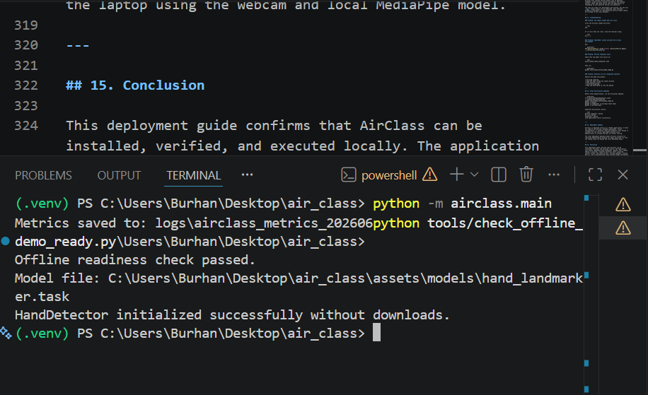
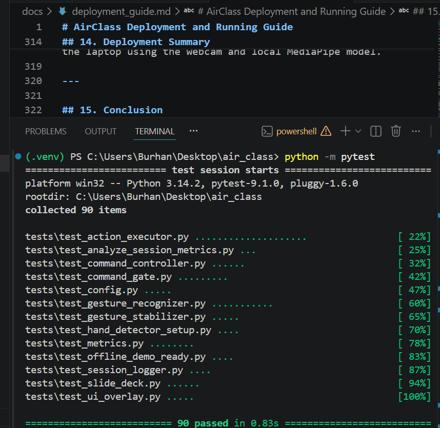
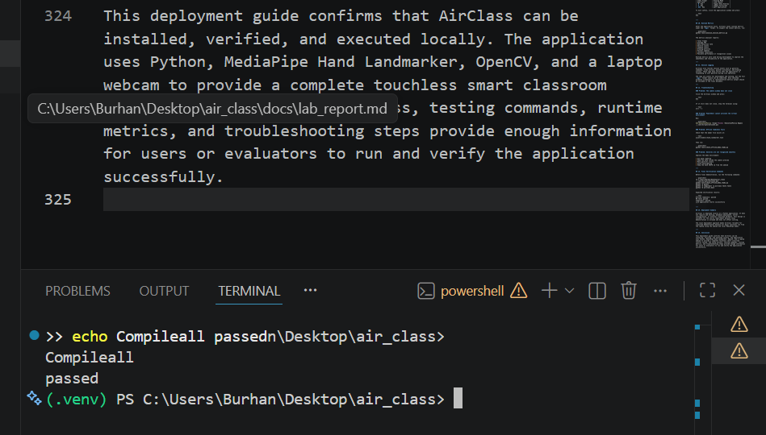
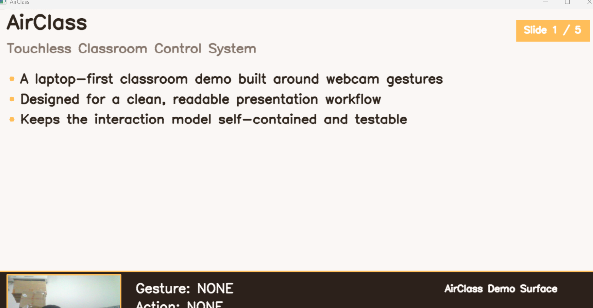
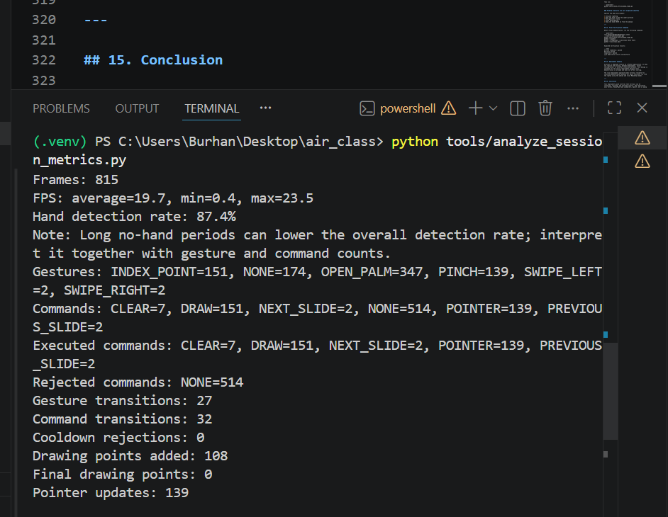

# AirClass Testing and Verification Evidence

**Project Title:** AirClass: Touchless Smart Classroom Control System
**Team Name:** Team_San
**Prepared by:** Mohamed Osman Abdi
**Student ID:** 2120256003
**Project Type:** Application-Based MediaPipe Course Design

---

## 1. Purpose of Testing

This document presents the testing and verification evidence for **AirClass: Touchless Smart Classroom Control System**. The purpose of testing was to confirm that the system works correctly as a complete MediaPipe-based Python application and that its major components are reliable before final submission.

The testing process focused on verifying:

* Offline MediaPipe model readiness
* Automated unit tests
* Python compilation checks
* Runtime metrics
* Live application startup
* Gesture-to-command functionality
* Local deployment readiness

This evidence supports the course requirement that the project should be a complete and easy-to-use application system with proper testing and deployment documentation.

---

## 2. Testing Environment

The testing was performed in a local development environment using a laptop.

| Item                    | Description                      |
| ----------------------- | -------------------------------- |
| Programming Language    | Python                           |
| Computer Vision Library | OpenCV                           |
| MediaPipe Component     | MediaPipe Hand Landmarker        |
| Testing Framework       | Pytest                           |
| Application Type        | Local desktop/client application |
| Input Device            | Laptop webcam                    |
| Execution Mode          | Offline local execution          |

The system was tested locally because the course requirements allow the front-end and back-end to be demonstrated in a development environment without affecting scoring.

---

## 3. Offline Readiness Test

AirClass uses a local MediaPipe hand landmarker model file for offline execution. The offline readiness test checks whether the required model file is available and whether the hand detector can initialize without needing internet access.

The command used was:

```powershell
python tools/check_offline_demo_ready.py
```

Expected result:

```text
Offline readiness: passed
```

### Figure 1. Offline Readiness Passed



This screenshot confirms that the system is ready for offline demonstration and that the MediaPipe model can be loaded locally.

---

## 4. Automated Unit Testing

The project includes automated tests for the major modules of the application, including configuration, gesture recognition, gesture stabilization, command mapping, command gating, action execution, slide deck behavior, metrics, logging, and offline readiness.

The command used was:

```powershell
python -m pytest
```

Final result:

```text
90 passed
```

### Figure 2. Pytest Result Showing 90 Passed



This result shows that the core system logic was tested successfully. The test suite confirms that important application behavior is stable and that later code changes did not break existing functionality.

---

## 5. Python Compilation Check

A compilation check was performed to confirm that the Python source files do not contain syntax errors.

The command used was:

```powershell
python -m compileall -q airclass tests tools
```

A successful compilation check does not print errors.

### Figure 3. Compileall Check Passed



This confirms that the project source code, tests, and tools are syntactically valid Python files.

---

## 6. Live Application Startup Test

The live application was started locally using:

```powershell
python -m airclass.main
```

The purpose of this test was to confirm that the application can launch correctly, open the camera, initialize MediaPipe Hand Landmarker, display the classroom interface, and respond to user gestures.

### Figure 4. Application Startup Terminal



This screenshot shows that the application was started from the terminal and entered the live demonstration mode successfully.

---

## 7. Runtime Metrics Verification

AirClass includes a runtime metrics system that records information about FPS, hand detection rate, gesture counts, command counts, drawing activity, pointer updates, slide navigation, and cooldown behavior.

After a live run, the metrics analyzer was executed using:

```powershell
python tools/analyze_session_metrics.py
```

A representative successful metrics result included:

```text
FPS average: 21.4
Hand detection rate: 89.7%
Cooldown rejections: 0
Drawing points added: 210
NEXT_SLIDE and PREVIOUS_SLIDE detected
POINTER and DRAW detected
No obvious problems detected
```

### Figure 5. Final Metrics Output



The metrics confirm that the system is not only functional, but also measurable. This was useful for improving the application during development and for verifying final demonstration readiness.

---

## 8. Functional Verification Summary

The following functions were verified during testing:

| Function                          | Verification Result |
| --------------------------------- | ------------------- |
| MediaPipe hand detection          | Passed              |
| Webcam capture                    | Passed              |
| Gesture recognition               | Passed              |
| Gesture stabilization             | Passed              |
| Command mapping                   | Passed              |
| Command gate for discrete actions | Passed              |
| Slide navigation                  | Passed              |
| Pointer mode                      | Passed              |
| Drawing mode                      | Passed              |
| Clear board gesture               | Passed              |
| Runtime metrics                   | Passed              |
| Session logging                   | Passed              |
| Offline readiness                 | Passed              |
| Automated tests                   | Passed              |
| Local application startup         | Passed              |

---

## 9. Testing Contribution

My contribution focused on testing, verification, and deployment evidence. I helped verify that the application could run locally, confirmed offline readiness, checked automated test results, reviewed deployment commands, documented the testing workflow, and prepared evidence screenshots for the final Team_San submission document.

This contribution supports the reliability of the project by showing that the application was tested systematically and that the final version is suitable for local demonstration.

---

## 10. Conclusion

The testing and verification evidence confirms that AirClass is a complete and working MediaPipe-based Python application. The system passed offline readiness checks, automated tests, compilation checks, and live startup verification. Runtime metrics also confirmed that the main gesture functions, including slide navigation, pointer mode, drawing mode, and clear gesture, were successfully detected and executed.

Therefore, AirClass is ready for final demonstration and submission as an application-based MediaPipe course design.
